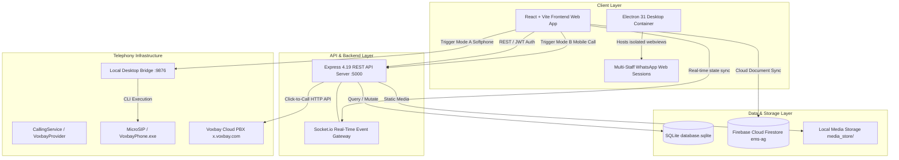
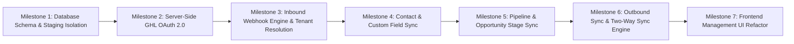

# EMS — GoHighLevel (GHL) Integration Phase 0: Safety & Staging Audit Report

**Document ID**: `GHL-PHASE-0-AUDIT-2026-08-27`  
**Target Project**: Employee Management Systems (EMS) / OmniFlow CRM  
**Date of Audit**: August 27, 2026  
**Status**: COMPLETE (Read-Only Audit & Safety Freeze)  
**Git Branch**: `feature/ghl-integration`  

---

## Executive Summary

This Phase 0 Audit was performed strictly under read-only, non-destructive safety conditions to inspect the current architecture of the EMS codebase, catalog all existing GoHighLevel (GHL) assets, detect security and multi-tenant isolation risks, identify documentation vs. source code mismatches, and establish an isolated staging protocol prior to beginning any Phase 1 GHL implementation work.

**Safety Compliance Summary**:
- **0** Production files deleted or renamed
- **0** Production databases modified
- **0** Production environment variables (`.env`) altered
- **0** Functional GHL code changes made during this phase
- **0** Changes to existing Voxbay Calling or WhatsApp Web desktop architectures
- Dedicated branch created: `feature/ghl-integration`

---

## A. Verified Project Root & Directory Layout

The exact filesystem hierarchy of the project was inspected directly:

| Component | Absolute / Relative Filesystem Path | Technology / Role |
| :--- | :--- | :--- |
| **Project Root** | `D:\AG Projects\whatsapp-crm` | Monorepo Root & Main Server Directory |
| **Frontend Root** | `D:\AG Projects\whatsapp-crm\frontend` | React 18 + Vite 5 + TailwindCSS / Design Tokens |
| **Backend Entry Point** | `D:\AG Projects\whatsapp-crm\server.js` | Node.js 18+ (ESM), Express 4.19, Socket.io 4.7 |
| **Database Engine** | `D:\AG Projects\whatsapp-crm\database.sqlite` | SQLite 3 (handled via `sqlite` & `sqlite3` packages) |
| **Database Schema** | `D:\AG Projects\whatsapp-crm\db.js` | Table initialization, migrations, and query helpers |
| **API Route Map** | `D:\AG Projects\whatsapp-crm\routes.js` | Express API route controller & middleware |
| **Desktop Suite** | `D:\AG Projects\whatsapp-crm\electron\main.cjs` | Electron 31 multi-session container for WhatsApp Web |
| **Telephony Services**| `D:\AG Projects\whatsapp-crm\services\calling` | Voxbay Provider, CallingService, & Desktop Softphone Bridge |
| **Secondary Backend** | `D:\AG Projects\whatsapp-crm\backend` | Nested backup/development clone |
| **Documentation** | `D:\AG Projects\whatsapp-crm\DOCUMENTATION` | Technical reports & architecture documentation |

---

## B. Current High-Level Architecture



---

## C. Frontend Architecture

1. **Framework & Tooling**:
   - React 18.2 with Vite build system.
   - Modular Engine Framework:
     - `MasterModuleRegistry.js`: Central module definitions and manifests.
     - `LayoutEngine.jsx`: Unified renderer supporting Kanban, List, Table, and Calendar views.
     - `KanbanEngine.jsx`: Drag-and-drop lead/deal pipeline board.
     - `PermissionEngine.js`: Role-Based Access Control (RBAC) supporting `superadmin`, `owner`, `admin`, `manager`, `employee`, and `agent`.
     - `SearchEngine.js`, `FilterEngine.js`, `SummaryEngine.js`, `ExportEngine.jsx`.
2. **State & Real-time Integration**:
   - Socket.io client listening for real-time contact updates, call status updates, and message events.
   - Dual persistence: Direct Node.js API queries coupled with Firebase Firestore listeners for configuration and audit documents.
3. **Desktop Integrations View**:
   - `IntegrationsPage.jsx`: Master control panel for webhooks, Odoo, Swiggy/Zomato, and GoHighLevel.

---

## D. Backend Architecture

1. **Server Stack**:
   - Node.js ESM modules (`type: module`).
   - Express 4.19 with raw body parser for Stripe webhooks and JSON body parser for CRM endpoints.
   - HTTP server wrapped with Socket.io for bi-directional live events.
2. **Session & Process Management**:
   - Background session runner in `sessionManager.js`.
   - Global error handling and unhandled rejection guards.
   - Process launcher scripts: `start_servers.bat`, `run_backend.bat`, `START_DESKTOP_APP.bat`.

---

## E. Database Architecture

The primary database is SQLite (`database.sqlite`) managed through `db.js`.

### Key Tables & Purpose:
1. `tenants`: Organization registry (`id`, `company_name`, `subscription_status`, `stripe_customer_id`).
2. `users`: User accounts (`id`, `email`, `password_hash`, `role`, `tenant_id`).
3. `tenant_settings`: JSON-serialized pipeline stages and tags keyed by `tenant_id`.
4. `contacts`: CRM contacts and leads (`id`, `name`, `custom_name`, `email`, `notes`, `pipeline_stage`, `labels`, `profile_pic_url`, `is_archived`, `deal_value`, `tenant_id`).
5. `whatsapp_sessions`: WhatsApp Web and Baileys session states.
6. `messages`: Stored WhatsApp and CRM communication history.
7. `lid_mappings`: Maps WhatsApp LID addresses to standard phone numbers.
8. `webhook_logs` / `audit_logs`: Inbound event auditing.
9. `calls` / `call_logs`: Telephony call detail records (CDR) and recording references.
10. `tenant_telephony_settings` / `telephony_settings`: Voxbay PBX credentials and routing modes per tenant.
11. `employees`, `attendance_logs`, `gps_locations`, `tasks`, `leaves`, `holidays`: HR and workforce management tables.

---

## F. Tenant Architecture & Isolation Analysis

- **Tenant Identifier**:
  - SQLite backend uses an integer `tenant_id` (e.g. `1`, `2`).
  - Frontend and Firestore use a string `companyId` (e.g. `'default_tenant'`, `'acme_corp'`).
- **Isolation Status**:
  - Most backend routes enforce `WHERE tenant_id = req.user.tenant_id`.
  - **Vulnerability Identified**: Several webhook and sync endpoints (`/api/v1/integrations/webhook/:companyId?`, `/api/v1/integrations/ghl/sync-live-contacts`) ignore the URL param `companyId` or incoming payload location and hardcode `tenantId = 1` when inserting contacts into SQLite.
  - **Tenant to GHL Location Mapping**: Currently no relational table exists to map `ghl_location_id (STRING)` <-> `tenant_id (INTEGER/STRING)`.

---

## G. Existing GHL Implementation Catalog

All existing GHL-related source code was inspected:

| File Location | Scope | Existing Functionality |
| :--- | :--- | :--- |
| `frontend/src/core/services/ghlOAuthService.js` | Frontend Service | Generates OAuth URL; executes client-side token exchange against `https://services.leadconnectorhq.com/oauth/token`; stores token records in Firestore / `localStorage`. |
| `frontend/src/components/pages/IntegrationsPage.jsx` | Frontend UI | Provides input fields for GHL App Client ID & Secret; saves keys to `localStorage`; displays connected location cards; triggers mock contact sync. |
| `routes.js` (Lines 1551-1639) | Backend API | `POST /api/v1/integrations/webhook/:companyId?/:source?`: Generic inbound receiver that parses incoming payloads, formats phone numbers as `phone@s.whatsapp.net`, and calls `saveContact(..., 1, 'lead')`. |
| `routes.js` (Lines 1643-1688) | Backend API | `POST /api/v1/integrations/ghl/sync-live-contacts`: Ingests contacts JSON array and inserts rows into `contacts` under `tenant_id = 1`. |
| `routes.js` (Lines 1690-1725) | Backend API | `GET /api/v1/integrations/oauth/callback`: Returns an HTML popup helper posting the OAuth authorization code back to `window.opener`. |

---

## H. OAuth Status: Client-Side vs Server-Side

- **Current State**: OAuth token exchange is handled on the **client side** inside `ghlOAuthService.js`.
- **Architectural Flaw**: The frontend requires the user to input their `client_secret` directly in the browser UI, which is then transmitted from the browser to LeadConnector.
- **Required Phase 1 Upgrade**: OAuth token exchange and automatic refresh token rotation MUST move exclusively to the backend Node.js server (`services/ghl/ghlAuthService.js`).

---

## I. Webhook Status

- **Current State**: A generic endpoint exists at `/api/v1/integrations/webhook/:companyId?/:source?`.
- **Validation**: No cryptographic signature validation (e.g. HMAC SHA256 or GHL webhook secret verification) is implemented.
- **Payload Handling**: Extracts flat properties (`first_name`, `phone`, `email`), but lacks support for full GHL standard event types (`ContactCreate`, `ContactUpdate`, `ContactDelete`, `OpportunityCreate`, `OpportunityStageUpdate`, etc.).

---

## J. Contact Sync Status

- **Current State**: One-way, partial inbound contact saving.
- **Identifiers**: No GHL Contact ID column exists in SQLite; contacts are keyed solely by phone number (`phone@s.whatsapp.net`) or fallback timestamp (`ghl_timestamp`).
- **Sync Logic**: No deduping by `ghl_contact_id`, no conflict resolution, no last-synced timestamp tracking.

---

## K. Pipeline / Stage Sync Status

- **Current State**: **NOT IMPLEMENTED**.
- **Backend Schema**: Pipeline stages are stored as an unstructured JSON array inside `tenant_settings.pipeline_stages`.
- **GHL Opportunity Integration**: No mapping between GHL Pipeline/Stage IDs and EMS stage keys. Moving a card in EMS Kanban does not trigger an outbound GHL Opportunity update.

---

## L. Custom Field Architecture & Status

- **Current State**: **NOT IMPLEMENTED**.
- **Backend Schema**: The `contacts` table contains no JSON `custom_fields` column.
- **GHL Custom Field Mapping**: No metadata mapping engine exists to translate GHL custom field keys to EMS schema fields.

---

## M. Two-Way Sync Status

- **Current State**: **ZERO TWO-WAY SYNCHRONIZATION**.
- Inbound sync is simulated or unauthenticated.
- Outbound sync (EMS -> GHL) does not exist anywhere in the codebase.
- No sync queue, retry mechanism, or webhook signature verification exists.

---

## N. Calling Architecture (MUST NOT BE MODIFIED)

- **Provider**: Voxbay Cloud Telephony.
- **Dual Mode Operation**:
  - **Mode A (Softphone)**: Local silent bridge daemon (`http://127.0.0.1:9876`) executing native commands to `VoxbayPhone.exe` (MicroSIP).
  - **Mode B (Mobile SIM / Click-to-Call)**: Cloud API trigger hitting `https://x.voxbay.com/api/click_to_call` to bridge agent mobile to customer phone.
- **Call Webhooks**: Handled via `/callcenterbridging` and `/api/calls/webhook`.
- **Safety Directive**: This architecture is fully functional and must remain completely untouched during GHL integration.

---

## O. WhatsApp Architecture (MUST NOT BE MODIFIED)

- **Architecture**:
  - Primary user model: Desktop multi-session WhatsApp Web manager running inside Electron 31 via isolated webview partitions (`persist:staff_*`).
  - Secondary / server-side session engine: `sessionManager.js` with Baileys auth state stored in `auth_info_baileys/`.
- **Safety Directive**: Do NOT replace or modify this architecture. Baileys is NOT being upgraded or added as a new dependency. The existing multi-WhatsApp-Web model must be preserved.

---

## P. Security Findings & Vulnerability Matrix

| Finding ID | Vulnerability / Issue | Location | Severity | Recommended Action for Phase 1 |
| :--- | :--- | :--- | :--- | :--- |
| **SEC-01** | GHL App `client_secret` exposed to browser & stored in `localStorage` | `frontend/src/core/services/ghlOAuthService.js`, `IntegrationsPage.jsx` | **CRITICAL** | Remove `client_secret` input from frontend. Implement server-side OAuth flow in backend Express with secrets kept exclusively in `.env`. |
| **SEC-02** | `authMiddleware` falls back to superadmin on invalid or missing JWT | `routes.js` (Lines 37-41) | **CRITICAL** | In production/staging, reject unauthenticated requests with `401 Unauthorized` instead of granting default superadmin access. |
| **SEC-03** | Telephony credentials hardcoded in source files | `services/calling/CallingService.js`, `VoxbayProvider.js` | **HIGH** | Move default UID, UPIN, DID credentials into `.env` variables and database tenant telephony settings. |
| **SEC-04** | Hardcoded local user directory exposed in static routes | `server.js` (`C:\Users\Lenovo\Desktop\Recordings`) | **HIGH** | Wrap in environment variable `RECORDINGS_LOCAL_DIR` with safe fallback to prevent filesystem exposure. |
| **SEC-05** | Fallback JWT secret string in code | `routes.js` (`'omniflow_super_secret_jwt_key'`) | **MEDIUM** | Enforce non-empty `process.env.JWT_SECRET` on server startup. |

---

## Q. Documentation vs. Actual Code Mismatches

1. **GHL Live Contact Sync**:
   - *Documentation / UI Claim*: Live real-time sub-account contact synchronization.
   - *Actual Code*: `handleSyncGhlLiveContacts` in `IntegrationsPage.jsx` dispatches a static hardcoded JavaScript array of 3 sample contacts to the backend.
2. **GHL OAuth 2.0 Integration**:
   - *Documentation / UI Claim*: Seamless 1-click marketplace OAuth install.
   - *Actual Code*: Requires user to paste Client Secret into the browser, executes OAuth exchange on client side, and stores tokens in Firestore/localStorage rather than SQLite backend.
3. **Two-Way Synchronization**:
   - *Documentation / UI Claim*: Bidirectional sync between GHL and EMS CRM.
   - *Actual Code*: Zero outbound API client calls to GoHighLevel exist in the backend.
4. **Custom Field & Pipeline Sync**:
   - *Documentation / UI Claim*: Custom field mapping and stage synchronization.
   - *Actual Code*: Completely non-existent in backend schema and routing.

---

## R. Existing Hardcoded Tenant & Credential Issues

1. **Inbound Webhook Tenant**: `routes.js` line 1588 passes hardcoded `tenantId = 1` to `saveContact()`.
2. **GHL Live Sync Endpoint**: `routes.js` line 1657 passes hardcoded `tenantId = 1` to `saveContact()`.
3. **Audit Log Tenant**: `routes.js` line 1604 falls back to `companyId || 'default_tenant'` and user ID `'system_webhook'`.
4. **Telephony Credentials**: `CallingService.js` line 52-54 contains fallback strings for `uid`, `upin`, `did`, and extension `2MaqwezO`.

---

## S. Recommended Staging Architecture

To ensure 100% isolation from production data, the following staging architecture is required:

```
Production Environment                           Staging Environment (Isolated)
-----------------------                           -------------------------------
- Port: 5000                                      - Port: 5001
- DB: database.sqlite                             - DB: database.staging.sqlite
- Config: .env                                    - Config: .env.staging
- GHL: Live Client ID / Live Location             - GHL: Sandbox App / Sandbox Sub-Account
- Domain: api.employeemanagementsystems.com      - Domain: http://localhost:5001 (or staging VPS port)
- Frontend: Port 5173 / Production Vercel        - Frontend: Port 5174 / Staging Preview
```

### Staging Verification Checklist:
- [ ] Create `.env.staging` with dedicated `PORT=5001`, `STAGING=true`, and `DB_PATH=database.staging.sqlite`.
- [ ] Initialize `database.staging.sqlite` with fresh schema without copying sensitive customer records.
- [ ] Configure a dedicated GHL Marketplace Test App on [developers.gohighlevel.com](https://developers.gohighlevel.com) targeting staging redirect URI `http://localhost:5001/api/v1/integrations/ghl/oauth/callback`.

---

## T. Exact Files Likely to be Modified in Phase 1

1. `db.js` — Add GHL integration table, location mapping table, GHL contact/opportunity ID columns, and sync log tables.
2. `server.js` — Register dedicated GHL router and raw webhook signature verification.
3. `routes.js` — Refactor / mount dedicated `/api/v1/integrations/ghl` route tree.
4. `services/ghl/ghlAuthService.js` *(NEW)* — Server-side OAuth 2.0 exchange, token storage, and automatic refresh rotation.
5. `services/ghl/ghlApiClient.js` *(NEW)* — Official GHL API v2 REST client (Contacts, Pipelines, Opportunities, Custom Fields).
6. `services/ghl/ghlWebhookService.js` *(NEW)* — Webhook processor with signature verification and tenant resolution.
7. `services/ghl/ghlSyncService.js` *(NEW)* — Two-way sync engine with conflict resolution and state tracking.
8. `frontend/src/core/services/ghlOAuthService.js` — Refactor to delegate all auth/token actions to backend API.
9. `frontend/src/components/pages/IntegrationsPage.jsx` — Update UI to remove Client Secret prompt and connect via backend OAuth redirect.

---

## U. Files & Modules That MUST NOT Be Modified

1. **Calling Services**:
   - `services/calling/CallingService.js`
   - `services/calling/VoxbayProvider.js`
   - `services/calling/desktopBridge.js`
   - `services/calling/VoxbayCloudDialerModal.jsx`
   - `services/calling/LOCKED_BACKUP/*`
   - `VOXBAY_LIVE_TELEPHONY_ARCHITECTURE.md`
2. **WhatsApp Architecture**:
   - `electron/main.cjs` (Webview session partitions)
   - `sessionManager.js` (Do NOT add Baileys or change session manager)
   - `frontend/src/components/pages/LiveWhatsAppWebPage.jsx`
3. **Core Workforce & HR Modules**:
   - `attendance_logs`, `gps_locations`, `leaves`, `payroll`, `recruitment`, `shifts`
4. **Production Files**:
   - `database.sqlite` (Production database file)
   - `.env` (Production environment configuration)

---

## V. Risks & Mitigation

| Risk | Impact | Mitigation Strategy |
| :--- | :--- | :--- |
| **Token Expiration / Rate Limiting** | Outbound sync fails if GHL access token expires or API limit is exceeded. | Implement automatic refresh token rotation before token expiration and exponential backoff retry queue in `ghlApiClient.js`. |
| **Infinite Sync Loops** | GHL webhook triggers EMS update which triggers GHL API update in an endless loop. | Add source origin metadata / sync version timestamps to suppress outbound webhooks for inbound-originated events. |
| **Multi-Tenant Cross-Contamination** | Inbound webhook updates the wrong tenant's contact. | Enforce strict `location_id` -> `tenant_id` lookup table; reject any webhook with unmapped Location ID. |
| **Production Data Pollution** | Test webhook data written to live CRM contacts. | All development and initial testing strictly executed on staging database and sandbox GHL sub-account. |

---

## W. Blockers

1. **GHL Developer App Credentials**: Client ID and Client Secret from GoHighLevel Developer Portal are required for sandbox testing.
2. **GHL Test Sub-Account Location**: An active GHL sandbox sub-account location is required to receive test webhooks and perform OAuth flow.

---

## X. Recommended Phase 1 Implementation Plan

Once approval is granted, Phase 1 should proceed according to the following phased milestones:



1. **Milestone 1**: Create staging environment (`.env.staging`, `database.staging.sqlite`) and run SQLite migrations for GHL integration tables.
2. **Milestone 2**: Implement `ghlAuthService.js` on the backend for secure OAuth code exchange and encrypted token persistence.
3. **Milestone 3**: Build `ghlWebhookService.js` to process real-time GHL webhooks and resolve tenant ownership via Location ID.
4. **Milestone 4**: Implement bi-directional contact synchronization and custom field mapping.
5. **Milestone 5**: Implement pipeline and opportunity stage synchronization.
6. **Milestone 6**: Implement outbound sync dispatcher with deduplication and loop prevention.
7. **Milestone 7**: Update `IntegrationsPage.jsx` to reflect real-time sync status, connected locations, and field mapping controls.

---

**Report Prepared By**: Antigravity AI Code Architect  
**Approved For Review**: YES  
