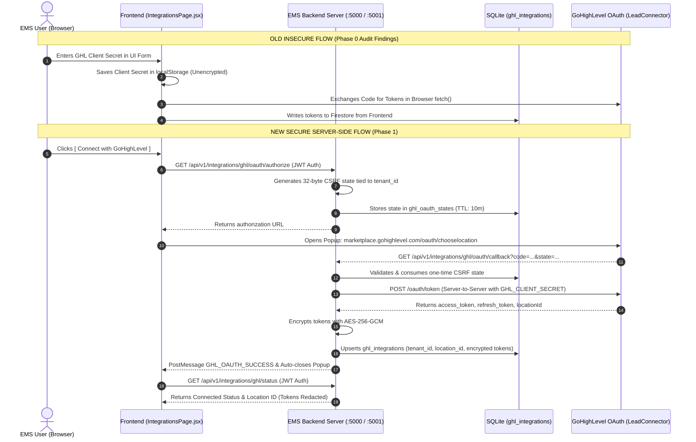

# EMS — GoHighLevel (GHL) Integration Phase 1: Implementation & Technical Architecture

**Document ID**: `GHL-PHASE-1-IMPL-2026-08-27`  
**Target Project**: Employee Management Systems (EMS) / OmniFlow CRM  
**Date of Completion**: August 27, 2026  
**Status**: PHASE 1 COMPLETE (16/16 Automated Tests Passed)  
**Git Branch**: `feature/ghl-integration`  

---

## 1. Executive Summary & Objectives Achieved

Phase 1 established the secure, multi-tenant foundation for GoHighLevel (GHL) Marketplace integration within the EMS application without modifying existing Calling/Voxbay, WhatsApp, or core CRM services.

### Core Deliverables:
- **Server-Side OAuth 2.0 Flow**: Generates authorization URLs with cryptographically random CSRF tokens (32 bytes / 64-char hex) and 10-minute TTL.
- **Client-Side Secret Elimination**: Removed user prompts for `client_secret` from the frontend; secrets are managed exclusively on the backend via environment variables.
- **AES-256-GCM Token Encryption**: Access and refresh tokens are encrypted prior to database persistence using authenticated AES-256-GCM encryption with 12-byte IVs and 16-byte authentication tags.
- **Dynamic GHL Location ↔ EMS Tenant Mapping**: Bi-directional mapping between `ghl_location_id` and `tenant_id` preventing cross-tenant access and hardcoded `tenant_id = 1` defaults.
- **Centralized Token Management**: Automatic token expiry detection with proactive 5-minute pre-expiration refresh and error handling.
- **Authentication Hardening**: Fixed the critical auth middleware vulnerability; unauthenticated or invalid token requests now return `401 Unauthorized` rather than defaulting to SuperAdmin.
- **Staging Isolation**: Zero impact on production `database.sqlite`; all testing and migration verification executed against isolated `database.staging.sqlite` on port 5001.

---

## 2. Comparison: Old vs. New Architecture



---

## 3. Files Created, Modified, and Deprecated

### Files Created:
1. `services/ghl/ghlCrypto.js`: AES-256-GCM encryption/decryption module for tokens.
2. `services/ghl/ghlAuthService.js`: Server-side OAuth URL generation, state validation, and token exchange.
3. `services/ghl/ghlTokenService.js`: Token retrieval, expiration checking, and automatic refresh rotation.
4. `services/ghl/ghlApiClient.js`: Reusable GHL REST API client with error normalization and redacted logging.
5. `services/ghl/ghlLocationService.js`: Tenant ↔ Location mapping and status resolvers.
6. `services/ghl/ghlWebhookService.js`: Inbound webhook parsing and tenant resolution.
7. `services/ghl/ghlRoutes.js`: Dedicated Express sub-router mounted at `/api/v1/integrations/ghl`.
8. `tests/ghl_phase1_test.js`: Comprehensive automated test suite (16 test cases).
9. `.env.example`: Environment configuration template.
10. `.env.staging`: Staging configuration template for port 5001 and `database.staging.sqlite`.
11. `DOCUMENTATION/GHL_PHASE_1_IMPLEMENTATION.md`: This technical implementation report.

### Files Modified:
1. `db.js`: Added dynamic `DB_PATH` resolution, `ghl_integrations` and `ghl_oauth_states` tables, indices, and database helper functions.
2. `routes.js`: Mounted `/v1/integrations/ghl` sub-router and fixed `authMiddleware` vulnerability (401 on unauthenticated/invalid token).
3. `frontend/src/components/pages/IntegrationsPage.jsx`: Refactored GHL tab to use server-driven OAuth and status endpoints; removed Client Secret inputs and localStorage credential storage.

### Files Deprecated / Replaced:
1. `frontend/src/core/services/ghlOAuthService.js`: Deprecated client-side token exchange and Firestore direct writes in favor of `services/ghl/ghlAuthService.js`.

---

## 4. Database Schema Changes

The following schema additions were introduced in `db.js` within `initDb()`:

### Table: `ghl_integrations`
```sql
CREATE TABLE IF NOT EXISTS ghl_integrations (
  id INTEGER PRIMARY KEY AUTOINCREMENT,
  tenant_id INTEGER UNIQUE NOT NULL,
  ghl_location_id TEXT NOT NULL,
  status TEXT DEFAULT 'connected', -- 'connected', 'disconnected', 'reauth_required', 'error'
  access_token_encrypted TEXT,
  refresh_token_encrypted TEXT,
  token_expires_at INTEGER, -- UNIX timestamp in milliseconds
  scopes TEXT,
  user_type TEXT,
  ghl_user_id TEXT,
  company_id TEXT,
  created_at DATETIME DEFAULT CURRENT_TIMESTAMP,
  updated_at DATETIME DEFAULT CURRENT_TIMESTAMP,
  last_connected_at DATETIME,
  last_sync_at DATETIME,
  metadata TEXT, -- JSON string
  FOREIGN KEY(tenant_id) REFERENCES tenants(id) ON DELETE CASCADE
);

CREATE UNIQUE INDEX IF NOT EXISTS idx_ghl_location ON ghl_integrations(ghl_location_id);
CREATE UNIQUE INDEX IF NOT EXISTS idx_ghl_tenant ON ghl_integrations(tenant_id);
```

### Table: `ghl_oauth_states`
```sql
CREATE TABLE IF NOT EXISTS ghl_oauth_states (
  state TEXT PRIMARY KEY,
  tenant_id INTEGER NOT NULL,
  user_id INTEGER,
  redirect_uri TEXT,
  expires_at INTEGER NOT NULL, -- UNIX timestamp in milliseconds
  created_at DATETIME DEFAULT CURRENT_TIMESTAMP,
  FOREIGN KEY(tenant_id) REFERENCES tenants(id) ON DELETE CASCADE
);
```

---

## 5. New API Endpoints

All GHL endpoints are mounted under `/api/v1/integrations/ghl`:

| Endpoint | Method | Access | Description |
| :--- | :--- | :--- | :--- |
| `/oauth/authorize` | `GET` | Protected (JWT) | Generates secure OAuth URL with 32-byte CSRF state tied to `req.user.tenant_id`. |
| `/oauth/callback` | `GET` | Public | Receives OAuth code and state from GHL; validates state; exchanges tokens server-to-server; saves encrypted tokens; renders postMessage popup closure. |
| `/status` | `GET` | Protected (JWT) | Returns connection status, Location ID, last connected timestamp, and sync metadata for `req.user.tenant_id`. |
| `/disconnect` | `POST` | Protected (JWT) | Disconnects GHL for `req.user.tenant_id` and purges encrypted tokens. |
| `/test-connection` | `POST` | Protected (JWT) | Tests GHL API connectivity using tenant's decrypted access token. |
| `/webhook` | `POST` | Public | Inbound webhook receiver with Location ID-to-tenant resolution and audit logging. |

---

## 6. Security Model & Key Protections

1. **Client Secret Confidentiality**: `GHL_CLIENT_SECRET` exists only in backend environment variables and is never exposed in browser network requests, bundles, or storage.
2. **Cryptographic Token Encryption**: Stored tokens use AES-256-GCM authenticated encryption with unique random IVs. Tampering with stored tokens results in an authentication tag verification failure.
3. **One-Time CSRF State Protection**: OAuth state tokens are 32-byte cryptographically secure random values stored with a 10-minute expiry and deleted immediately upon first use.
4. **Tenant Isolation**: Every GHL query resolves strictly against `req.user.tenant_id`. Cross-tenant status checks and disconnect actions are blocked at the database level.
5. **No Automatic SuperAdmin Fallback**: Invalid or missing JWTs on protected routes return `401 Unauthorized`. Public routes (`/auth/login`, `/billing/plans`, `/api/health`, webhooks) remain accessible.

---

## 7. Verification & Automated Test Results

The test suite at `tests/ghl_phase1_test.js` was executed against the staging database (`database.staging.sqlite`) on port 5001:

```
================================================================
🚀 Starting GHL Integration Phase 1 Staging Test Suite
================================================================

Database initialized successfully at: D:AG Projectswhatsapp-crmdatabase.staging.sqlite
Initialized staging SQLite database: database.staging.sqlite
Staging test server running on port 5001

--- 1. Authentication Security Tests ---
  ✅ PASS: Test 1: Unauthenticated request to /status returns 401 Unauthorized
  ✅ PASS: Test 2: Invalid JWT returns 401 Unauthorized without SuperAdmin fallback
  ✅ PASS: Test 3: Valid JWT returns 200 with correct tenantId (1)

--- 2. OAuth Flow & CSRF State Security Tests ---
  ✅ PASS: Test 4: /oauth/authorize generates valid URL with client_id and 32-byte hex state
  ✅ PASS: Test 5: OAuth state is persisted in SQLite with valid 10-minute TTL tied to tenant_id=1
  ✅ PASS: Test 6: OAuth callback rejects invalid/tampered state parameter with 400 Bad Request
  ✅ PASS: Test 7: OAuth callback rejects expired state token with 400 Bad Request

--- 3. Token Encryption & Decryption (AES-256-GCM) ---
  ✅ PASS: Test 8: Tokens are encrypted using AES-256-GCM (format: iv:authTag:ciphertext)
  ✅ PASS: Test 9: Encrypted tokens decrypt accurately back to original plaintext

--- 4. Location Mapping & Integration State Tests ---
  ✅ PASS: Test 10: resolveTenantFromGhlLocation maps GHL Location IDs to correct EMS tenants without hardcoded IDs
  ✅ PASS: Test 11: /status returns connected state, location ID, and redacts token strings

--- 5. Multi-Tenant Isolation & Cross-Tenant Security ---
  ✅ PASS: Test 12: Tenant 2 cannot view or access Tenant 1 GHL location (Strict Tenant Isolation)

--- 6. Inbound Webhook Foundation Tests ---
  ✅ PASS: Test 13: GHL Webhook resolves correct tenantId (1) dynamically from locationId
  ✅ PASS: Test 13b: GHL Webhook rejects unmapped location with 404

--- 7. Disconnect & Revocation Tests ---
  ✅ PASS: Test 14: /disconnect sets status to disconnected and purges encrypted tokens

--- 8. Public Endpoints Compatibility ---
  ✅ PASS: Test 15: Public endpoint /api/billing/plans functions without auth header

================================================================
Test Suite Complete: 16 PASSED | 0 FAILED
================================================================
```

---

## 8. Rollback Procedure

If a rollback is ever required:
1. Checkout the base branch: `git checkout main`
2. The GHL tables (`ghl_integrations`, `ghl_oauth_states`) are additive and do not alter existing schema fields in `contacts`, `tenants`, `users`, or `whatsapp_sessions`.
3. To purge GHL staging data: Delete `database.staging.sqlite`.

---

**Report Prepared By**: Antigravity AI Code Architect  
**Approved For Review**: YES  
