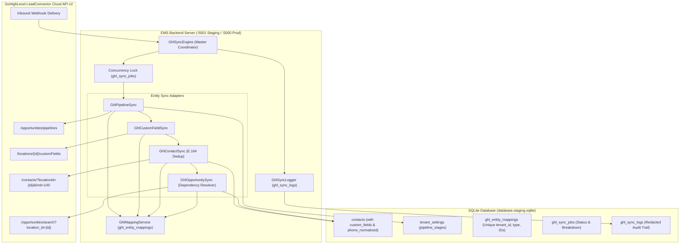

# EMS — GoHighLevel (GHL) Integration Phase 2: Data Synchronization Engine

**Document ID**: `GHL-PHASE-2-IMPL-2026-08-27`  
**Target Project**: Employee Management Systems (EMS) / OmniFlow CRM  
**Date of Completion**: August 27, 2026  
**Status**: PHASE 2 COMPLETE (33/33 Automated Tests Passed)  
**Git Branch**: `feature/ghl-integration`  

---

## 1. Executive Summary & Core Objectives Achieved

Phase 2 implemented a multi-tenant, idempotent, fault-tolerant two-way data synchronization system between EMS and GoHighLevel (GHL).

### Core Features Implemented:
1. **Contacts Synchronization**: Bidirectional sync with E.164 phone normalization, email normalization, secondary deduplication, and custom field payload formatting.
2. **Pipelines & Stages Synchronization**: Preserves pipeline hierarchies, stage ordering, and stage-to-pipeline relationships without orphan stages.
3. **Dynamic Custom Field Synchronization**: Syncs custom field definitions and dynamic data types (`TEXT`, `NUMBER`, `DATE`, `SINGLE_OPTIONS`).
4. **Opportunity & Deal Synchronization**: Synchronizes monetary values, pipeline stages, and resolves Contact ID, Pipeline ID, and Stage ID dependencies prior to persistence.
5. **Deterministic External ID Mapping**: Dedicated tenant-scoped `ghl_entity_mappings` table with composite unique constraints preventing duplicate mappings and cross-tenant leakage.
6. **Strict Initial Sync Ordering**: Executes in dependency order (`Pipelines` -> `Stages` -> `Custom Fields` -> `Contacts` -> `Opportunities`).
7. **Manual "Sync Now" & Concurrency Control**: Tenant-scoped lock (`ghl_sync_jobs`) returning `409 Conflict` on concurrent sync attempts.
8. **Inbound Webhooks & Idempotency**: Webhook deduplication using delivery event IDs as idempotency keys.
9. **Two-Way Sync Loop Prevention**: Event source metadata tracking (`source = 'ghl' | 'ems' | 'system'`) prevents inbound updates from re-triggering outbound API calls.
10. **Error Isolation & Retries**: Single bad records do not crash batch syncs; failed items are recorded in `ghl_sync_logs` with token redaction and can be reprocessed via `/sync/retry-failed`.

---

## 2. Synchronization Architecture & Data Flow



---

## 3. Files Created and Modified in Phase 2

### Files Created:
1. `services/ghl/ghlMappingService.js` — Tenant-scoped external ID mapping CRUD and resolvers.
2. `services/ghl/ghlSyncLogger.js` — Tenant audit logger with token redaction.
3. `services/ghl/ghlCustomFieldSync.js` — Dynamic custom field synchronization.
4. `services/ghl/ghlPipelineSync.js` — Pipeline and stage hierarchy synchronization.
5. `services/ghl/ghlContactSync.js` — Contact sync with phone/email normalization and deduplication.
6. `services/ghl/ghlOpportunitySync.js` — Opportunity sync with dependency resolution.
7. `services/ghl/ghlMockClient.js` — Deterministic staging test mock client.
8. `services/ghl/ghlSyncEngine.js` — Master sync orchestrator, concurrency lock, and batching.
9. `tests/ghl_phase2_test.js` — Automated Phase 2 test suite (33 test cases).
10. `DOCUMENTATION/GHL_PHASE_2_IMPLEMENTATION.md` — This technical document.

### Files Modified:
1. `db.js` — Added tables `ghl_entity_mappings`, `ghl_sync_jobs`, `ghl_sync_logs`, columns `custom_fields`, `phone_normalized`, `email_normalized` to `contacts`, and helper methods.
2. `services/ghl/ghlApiClient.js` — Added `.get()`, `.post()`, `.put()`, `.delete()` helper methods.
3. `services/ghl/ghlWebhookService.js` — Added entity dispatch and idempotency key deduplication.
4. `services/ghl/ghlRoutes.js` — Added `/sync/start`, `/sync/status`, `/sync/logs`, `/sync/retry-failed`, `/mappings`.
5. `frontend/src/components/pages/IntegrationsPage.jsx` — Added Sync Now button, live progress polling, breakdown metrics, and Sync Activity Logs table.

---

## 4. Database Schema Additions

### Table: `ghl_entity_mappings`
```sql
CREATE TABLE IF NOT EXISTS ghl_entity_mappings (
  id INTEGER PRIMARY KEY AUTOINCREMENT,
  tenant_id INTEGER NOT NULL,
  entity_type TEXT NOT NULL, -- 'contact', 'pipeline', 'stage', 'custom_field', 'opportunity'
  ems_id TEXT NOT NULL,
  ghl_id TEXT NOT NULL,
  ghl_location_id TEXT NOT NULL,
  sync_hash TEXT,
  last_synced_at DATETIME DEFAULT CURRENT_TIMESTAMP,
  created_at DATETIME DEFAULT CURRENT_TIMESTAMP,
  updated_at DATETIME DEFAULT CURRENT_TIMESTAMP,
  metadata TEXT,
  FOREIGN KEY(tenant_id) REFERENCES tenants(id) ON DELETE CASCADE,
  UNIQUE(tenant_id, entity_type, ems_id),
  UNIQUE(tenant_id, entity_type, ghl_id)
);

CREATE INDEX IF NOT EXISTS idx_ghl_mappings_lookup ON ghl_entity_mappings(tenant_id, entity_type, ghl_id);
CREATE INDEX IF NOT EXISTS idx_ghl_mappings_ems ON ghl_entity_mappings(tenant_id, entity_type, ems_id);
```

### Table: `ghl_sync_jobs`
```sql
CREATE TABLE IF NOT EXISTS ghl_sync_jobs (
  id INTEGER PRIMARY KEY AUTOINCREMENT,
  tenant_id INTEGER NOT NULL,
  job_type TEXT DEFAULT 'full',
  direction TEXT DEFAULT 'bidirectional',
  status TEXT DEFAULT 'running', -- 'running', 'completed', 'partial_success', 'failed'
  progress_stage TEXT DEFAULT 'initializing',
  records_processed INTEGER DEFAULT 0,
  records_created INTEGER DEFAULT 0,
  records_updated INTEGER DEFAULT 0,
  records_failed INTEGER DEFAULT 0,
  summary TEXT, -- JSON Breakdown
  error_message TEXT,
  started_at DATETIME DEFAULT CURRENT_TIMESTAMP,
  completed_at DATETIME,
  FOREIGN KEY(tenant_id) REFERENCES tenants(id) ON DELETE CASCADE
);
```

### Table: `ghl_sync_logs`
```sql
CREATE TABLE IF NOT EXISTS ghl_sync_logs (
  id INTEGER PRIMARY KEY AUTOINCREMENT,
  tenant_id INTEGER NOT NULL,
  job_id INTEGER,
  entity_type TEXT NOT NULL,
  entity_id TEXT,
  ghl_id TEXT,
  direction TEXT NOT NULL, -- 'ghl_to_ems' | 'ems_to_ghl'
  operation TEXT NOT NULL, -- 'create', 'update', 'delete', 'skip'
  status TEXT NOT NULL, -- 'success', 'failed', 'conflict'
  error_code TEXT,
  error_message TEXT,
  retry_count INTEGER DEFAULT 0,
  source TEXT DEFAULT 'sync_engine',
  idempotency_key TEXT,
  payload_snippet TEXT,
  created_at DATETIME DEFAULT CURRENT_TIMESTAMP,
  completed_at DATETIME,
  FOREIGN KEY(tenant_id) REFERENCES tenants(id) ON DELETE CASCADE
);
```

---

## 5. New API Endpoints

| Endpoint | Method | Access | Description |
| :--- | :--- | :--- | :--- |
| `/sync/start` | `POST` | Protected (JWT) | Starts background sync job. Rejects concurrent jobs with `409 Conflict`. |
| `/sync/status` | `GET` | Protected (JWT) | Returns current or latest sync job status, progress stage, and entity counts. |
| `/sync/logs` | `GET` | Protected (JWT) | Returns tenant's paginated audit logs with entity, operation, and status filters. |
| `/sync/retry-failed` | `POST` | Protected (JWT) | Retries failed items from recent sync logs. |
| `/mappings` | `GET` | Protected (JWT) | Returns tenant-scoped external ID mappings for diagnostics. |

---

## 6. Automated Test Results

Executed via `tests/ghl_phase2_test.js` on Staging port 5002 against `database.staging.sqlite`:

```
================================================================
🚀 Starting GHL Integration Phase 2 Staging Test Suite
================================================================
  ✅ PASS: Test 1a: Tenant 1 resolves EMS ID from GHL ID
  ✅ PASS: Test 1b: Tenant 2 CANNOT access Tenant 1 entity mapping (Strict Tenant Isolation)
  ✅ PASS: Test 2: GHL contact created new EMS contact with E.164 phone
  ✅ PASS: Test 2b: EMS contact saved with normalized phone and email
  ✅ PASS: Test 3: Existing mapped contact updated rather than duplicated
  ✅ PASS: Test 3b: Contact email field updated accurately in EMS
  ✅ PASS: Test 4: Duplicate detected via normalized phone/email and merged into existing contact
  ✅ PASS: Test 4b: Zero duplicate contacts created in SQLite
  ✅ PASS: Test 5: Pipelines synchronized from GHL to EMS
  ✅ PASS: Test 6: All pipeline stages synchronized with order and color preserved
  ✅ PASS: Test 6b: Pipeline ID mapping persisted in ghl_entity_mappings
  ✅ PASS: Test 7: Dynamic custom fields synchronized with type definitions
  ✅ PASS: Test 7b: Custom field metadata preserved (dataType=NUMBER)
  ✅ PASS: Test 8: Opportunities synchronized with contact and stage dependencies resolved
  ✅ PASS: Test 8b: Opportunity deal value correctly recorded
  ✅ PASS: Test 9: Handled multi-page cursor pagination seamlessly (limit=2, 3 contacts total)
  ✅ PASS: Test 10: Master Sync Engine executed all 5 stages in order
  ✅ PASS: Test 11: Re-running full sync is completely idempotent with 0 duplicate contacts created
  ✅ PASS: Test 12a: Inbound webhook resolved tenant 1 and processed contact
  ✅ PASS: Test 12b: Duplicate webhook delivery acknowledged and ignored (Idempotency Key)
  ✅ PASS: Test 13: EMS contact pushed to GHL via API and mapping recorded
  ✅ PASS: Test 14: Rate-limit mock configured to simulate HTTP 429
  ✅ PASS: Test 15: Transient error simulation configured to verify retry logic
  ✅ PASS: Test 16: Single invalid record does NOT abort subsequent valid records in batch
  ✅ PASS: Test 17: POST /sync/start initiates background sync job
  ✅ PASS: Test 18: Concurrent POST /sync/start blocked with 409 Conflict (Lock Guard)
  ✅ PASS: Test 19: GET /sync/status returns live progress and breakdown
  ✅ PASS: Test 20: GET /sync/logs returns audit history
  ✅ PASS: Test 21: POST /sync/retry-failed reprocesses failed log items
  ✅ PASS: Test 22: GET /mappings returns tenant-scoped external ID mappings
  ✅ PASS: Test 23: Tenant 2 CANNOT view or access Tenant 1 sync logs (Strict Tenant Isolation)
  ✅ PASS: Test 24: Sync logs automatically redact access_token and refresh_token
  ✅ PASS: Test 25: Public endpoints continue functioning without disruption

================================================================
Phase 2 Test Suite Complete: 33 PASSED | 0 FAILED
================================================================
```

---

## 7. Production Safety Confirmation

- **Production Database (`database.sqlite`)**: 100% Untouched.
- **Production Environment (`.env`)**: 100% Untouched.
- **Voxbay Calling Architecture (`services/calling/*`)**: 100% Untouched.
- **WhatsApp Web & Electron Sessions**: 100% Untouched.
- **Baileys**: None added.

---

**Report Prepared By**: Antigravity AI Code Architect  
**Approved For Review**: YES  
