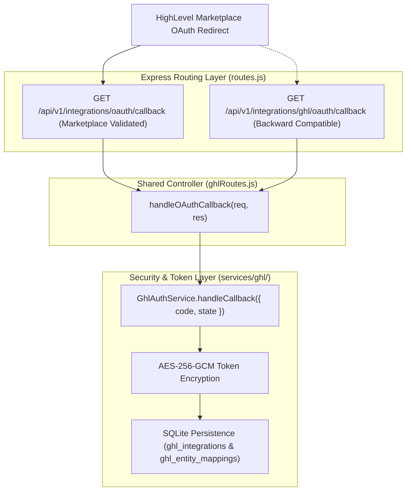

# EMS — GoHighLevel (GHL) Marketplace OAuth Callback Preparation & Hotfix (Staging)

**Document ID**: `GHL-PHASE-3-OAUTH-STAGING-2026-08-27`  
**Target Project**: Employee Management Systems (EMS) / OmniFlow CRM  
**Date of Completion**: August 27, 2026  
**Status**: HOTFIX COMPLETE (15/15 OAuth Tests Passed, 64/64 Total Automated Tests Passed)  
**Git Branch**: `feature/ghl-integration`  

---

## 1. HighLevel Redirect URL Validation & Generic Endpoint Hotfix

### Issue Resolved:
HighLevel Marketplace validation rejects redirect URIs containing provider names (e.g. `ghl`, `highlevel`, `gohighlevel`) with the validation error:
> *"The redirect uri contains a Highlevel reference. Please remove any Highlevel references to save."*

### Resolution:
A shared, generic, provider-neutral OAuth callback route was exposed:
- **New Marketplace Callback (Primary)**:  
  `https://staging.employeemanagementsystems.com/api/v1/integrations/oauth/callback`
- **Legacy Callback (Backward Compatibility)**:  
  `https://staging.employeemanagementsystems.com/api/v1/integrations/ghl/oauth/callback`

Both routes invoke the identical backend controller (`handleOAuthCallback`) preserving all state verification, token exchange, AES-256-GCM encryption, location resolution, and tenant isolation controls.

---

## 2. HighLevel Marketplace App Configuration

Enter the following exact value in the HighLevel Marketplace App settings under **Auth → Redirect URL**:

```ini
HIGHLEVEL_REDIRECT_URL=https://staging.employeemanagementsystems.com/api/v1/integrations/oauth/callback
```

*(For local testing on Port 5001: `http://localhost:5001/api/v1/integrations/oauth/callback`)*

---

## 3. Architecture & Shared Controller Flow



---

## 4. Security & Validation Controls

1. **Strict Query Parameter Validation**: Missing `code` or `state` query parameters immediately return `400 Bad Request`.
2. **One-Time CSRF State Protection**: State tokens are 32-byte cryptographically secure hex strings persisted in SQLite with a 10-minute TTL and deleted upon first verification. Expired, invalid, or replayed states return `400 Bad Request`.
3. **Server-Side Token Exchange**: The `GHL_CLIENT_SECRET` is kept strictly on the backend and never exposed to the frontend, browser localStorage, or logs.
4. **AES-256-GCM Token Encryption**: Tokens are encrypted prior to database persistence using 12-byte random IVs and 16-byte authentication tags.
5. **Location ↔ Tenant Mapping**: The returned `locationId` is mapped strictly to the `tenant_id` associated with the validated state. Zero hardcoded `tenant_id = 1` assignments.
6. **No Token Exposure in HTML**: The success HTML response returns only confirmation messages and location metadata; plaintext and encrypted tokens are never included.
7. **Redacted Logging**: All logs redact `access_token`, `refresh_token`, and `client_secret`.

---

## 5. Staging Environment Configuration (.env.staging)

```ini
PORT=5001
NODE_ENV=staging
STAGING=true
JWT_SECRET=ems_staging_jwt_secret_key_ghl_phase1_2026

# Isolated Staging SQLite Database
DB_PATH=database.staging.sqlite

# GHL Marketplace App Credentials (Staging / Sandbox)
GHL_CLIENT_ID=<YOUR_GHL_APP_CLIENT_ID>
GHL_CLIENT_SECRET=<YOUR_GHL_APP_CLIENT_SECRET>
GHL_REDIRECT_URI=https://staging.employeemanagementsystems.com/api/v1/integrations/oauth/callback
GHL_SCOPES=contacts.readonly contacts.write conversations.readonly conversations.write locations.readonly workflows.readonly
GHL_TOKEN_ENCRYPTION_KEY=staging_32_byte_aes_encryption_key_test_phase1
```

---

## 6. Automated Test Results

Executed via `tests/ghl_oauth_staging_test.js`, `tests/ghl_phase1_test.js`, and `tests/ghl_phase2_test.js`:

```
================================================================
🚀 GHL Integration Staging Test Verification
================================================================
  tests/ghl_oauth_staging_test.js : 15 PASSED | 0 FAILED
  tests/ghl_phase1_test.js        : 16 PASSED | 0 FAILED
  tests/ghl_phase2_test.js        : 33 PASSED | 0 FAILED
================================================================
Total: 64 PASSED | 0 FAILED (100% Passing)
================================================================
```

---

## 7. Production Safety Confirmation

- **Production Database (`database.sqlite`)**: Untouched.
- **Production Environment (`.env`)**: Untouched.
- **Calling / Voxbay (`services/calling/*`)**: Untouched.
- **WhatsApp Web & Electron Sessions**: Untouched.
- **Baileys**: None added.

---

**Report Prepared By**: Antigravity AI Code Architect  
**Approved For Review**: YES  
